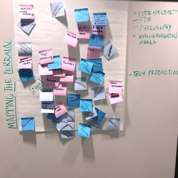
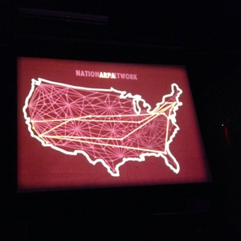

Now in its sixth year, the LibLab Fellows program is an experiment in library-based learning guided by a critical consideration of just what we mean by "the digital." Fellows engage theory and practice of digital scholarship through open lab hours and weekly discussion meetings during the fall semester.

We will be making use of the data visualization platform [Observable](https://observablehq.com), working on what might be called the ["Computational Essays"](https://observablehq.com/@bulbil/computational-essay) during the course of the semester. [You can explore some of past work along with notebooks that inspired us here.](https://observablehq.com/collection/@bulbil/lib-lab-2019)

## [Week 1: Pshhhkkkkkkrrrrkakingkakingkakingtshchchchchchchchcch*ding*ding*ding](https://observablehq.com/@bulbil/pshhhkkkkkkrrrrkakingkakingkakingtshchchchchchchch)

An introduction to the terrain.

[Observable notebook for this week's discussion.](https://observablehq.com/@bulbil/pshhhkkkkkkrrrrkakingkakingkakingtshchchchchchchch)

- [Madrigal, Alexis C. "The Mechanics and Meaning". *The Atlantic*.](https://www.theatlantic.com/technology/archive/2012/06/the-mechanics-and-meaning-of-that-ol-dial-up-modem-sound/257816/)
- [The Programing Historian: Introduction to the Bash Command Line](https://programminghistorian.org/en/lessons/intro-to-bash)
- [Pratusevich, Michele .*Terminus* (2011).](http://www.mprat.org/projects/terminus/)(optional)
    - Text-based adventure game that teaches users how to use terminal commands.

## Week 2: Do Artifacts Have Politics?

What can things *do*? Considering the perspective of Science and Technology Studies.

<!--[Observable notebook for this week's discussion .](https://observablehq.com/@betovargas/do-artifacts-have-politics)-->

- [Winner, Langdon. "Do Artifacts Have Politics?" from *The Whale and the Reactor* (1986).](https://www.cc.gatech.edu/~beki/cs4001/Winner.pdf)
- [Biss, Eula. "Time and Distance Overcome" from *Notes from No Man's Land* (2009).](https://ir.uiowa.edu/cgi/viewcontent.cgi?article=6414&context=iowareview)

## Week 3: Considering Infrastructure

Before we can go further into networked technologies, we ought to have a starting point -- What do we mean when we say *internet*?

- [Abbate, Janet. "Government, Business, and the Making of the Internet." *The Business History Review* (Spring 2001)](https://www.zotero.org/groups/2224126/liblab/items/CE7JGUQ9/file)
- [Visions for the Future Internet](https://findingctrl.nesta.org.uk/) A collection of essays, short stories, poetry and art work reflecting on the question of *what is the internet* and its history. As you browse the site focus on one section (Timeline, Enter, Power, Shift, Delete, ALT, Escape) that most interests you. Come prepared to share your thoughts and opinions

## Week 4: Getting used to Observable + Intro to Data

*No readings this week.* We will spend our time getting to know Observable and some of its quirks. Also, since our projects require us to get our hands dirty with data, we will chat about how we use data in our daily life and what we will need to consider to choose a dataset for our project.  

To that end, Lisa Gitelman and Virginia Jackson write in the introduction for *"Raw Data" Is an Oxymoron*, 
>"Data need to be imagined as data to exist and function as such, and the imagination of data entails an interpretive base."

*For next week:*  
- What do the authors mean when they write that "data need to be imagined"?
- Find an Observable notebook that is data-driven and appeals to you. You can always begin in the [explore](https://observablehq.com/explore) section of Observablehq.com but feel free to look elsewhere.

## Week 5: Language of Visualization

What are we doing exactly when we render data (or anything) visual or legible?  Public health, natural catastrophe, electoral politics, and social inequality. Chart, map, and graph. Increasingly, our understanding of the world is mediated by dynamic representations of data attempting to model real world phenomena. In the process, what do we gain access to and, oppositely, what is effaced or made invisible?

- [Drucker, Johanna. “Graphical Approaches to the Digital Humanities.” *A New Companion to Digital Humanities*, edited by Susan Schreibman et al. (2016): 290–302.](https://ebookcentral.proquest.com/lib/swarthmore/reader.action?docID=4093339&ppg=290)
- [Mattern, Shannon. "How to Map Nothing." *Places Journal* (March, 2021)](https://placesjournal.org/article/how-to-map-nothing/?cn-reloaded=1)
- [Daniels, Matt. "The Language of Hip Hop." *The Pudding* (2017).](https://pudding.cool/2017/02/vocabulary/) 
- [Choi, Taeyoon. "Errantic Poetry." from *Poetic Computation*. taeyoonchoi.com](http://taeyoonchoi.com/poetic-computation/errantic-poetry/)
- *Optional* [D'Ignazio, Catherine and Klein, Lauren. "On Rational, Scientific, Objective Viewpoints from Mythical, Imaginary, Impossible Standpoints." (chapter draft) In *Data Feminism* (MIT, 2020).](https://bookbook.pubpub.org/pub/8tjbs2x5)
- *optional in class reading*[Osman, Jenna. from *Motion Studies*. PEN Poetry Series. November 25, 2015.](https://pen.org/from-motion-studies/)

## Week 6: Fall Break 

## Week 7: When Computers Were Women: Feminism & Technology

- [Haraway, Donna. "A Cyborg Manifesto: Science, Technology, and Socialist-Feminism in the Late Twentieth Century" in Simians, Cyborgs and Women: The Reinvention of Nature (New York; Routledge, 1991), pp.149-181](https://www.sfu.ca/~decaste/OISE/page2/files/HarawayCyborg.pdf)
- [Kane, Nancy. "Cyborg Manifesto," Encyclopedia of Gender and Society. (this may help you frame some of the strangeness of the Haraway piece and point out its significance)](https://sk.sagepub.com/reference/gender/n99.xml)
- [Light, Jennifer. "When Computers Were Women." Technology and Culture.](https://www.jstor.org/stable/25147356)

## Week 8: On Clouds

Circling back to our earlier conversation about how the web works, when so much of infrastructure involves the effort to ensure it remains invisible, what does it take to make sense of infrastructure, that is, make infrastructure sensible and perceptible?

- [Tung-Hui, Hu. “Introduction.” In *A Prehistory of the Cloud* (2015)](https://ebookcentral.proquest.com/lib/swarthmore/reader.action?docID=3433802&ppg=10)
- [Simon, Johnny. “These Beautiful Photos Reveal the Internet Is Hiding in Plain Sight.” *Quartz*. October 5, 2016.](https://qz.com/770849/these-beautiful-photos-reveal-the-internet-is-hiding-in-plain-sight/)
- [How Amazon uses 18-wheeler to transfer heavy data loads to the cloud](https://www.cnbc.com/2019/07/19/how-amazon-uses-snowmobile-trucks-snowball-devices-for-data-transfer.html)
- [Donnelly, Timothy. "The Cloud Corporation." *Poetry Foundation*.](https://www.poetryfoundation.org/poems/54305/the-cloud-corporation)
- *related previous reading* [Mattern, Shannon. "How to Map Nothing." *Places Journal* (March, 2021)](https://placesjournal.org/article/how-to-map-nothing/?cn-reloaded=1)
- *optional* [Jackson, Steven. 2014. "Rethinking Repair," from Media Technologies: Essays on Communication, Materiality, and Society](https://sjackson.infosci.cornell.edu/RethinkingRepairPROOFS(reduced)Aug2013.pdf)

## Week 9: Observable and the Computational Essay

## Week 10: Surveillance & Privacy

Is the internet listening? Is the internet listening to everybody? What if, by design, we can never know for sure? This week we will focus on the porous border between technical, social, and personal implications of continuous data collection.

- [The New Organs](https://neworgans.net/) Watch the 10 minute video and explore the landing page.

"The New Organs is a project to gather, archive and investigate the theories and realities of corporate surveillance."

- [Cyril, Malkia. "Watching the Black Body." In *McSweeney’s* 54, pp. 0134-0146.](https://www.eff.org/deeplinks/2019/02/watching-black-body)
- [FBI report for Black Identity Extremist](https://www.documentcloud.org/documents/4067711-BIE-Redacted.html)
- *Optional* [Brunton, Fin & Nissenbaum, Helen. "Why is Obfuscation Necessary." In *Obfuscation: A User's Guide for Privacy and Protest*."](https://www.zotero.org/groups/2224126/liblab/items/386WF94A/file)

## Week 11: Algorithms

The question of "What is an Algorithm?" is as important as the question of "What does an Algorithm do?"  There is a tension at play in what these authors are writing about and as you read and watch, pay attention to their answers to both questions. How would you answer?

- [Schmidth, Ben. "Do Digital Humanists Need to Understand Algorithms?" *Debates in the Digital Humanities 2016*, edited by Gold, Matthew and Klein, Lauren.](https://dhdebates.gc.cuny.edu/read/untitled/section/557c453b-4abb-48ce-8c38-a77e24d3f0bd)
- [Bogost, Ian. "The Cathedral of Computation." *The Atlantic*. January 15, 2015.](https://www.theatlantic.com/technology/archive/2015/01/the-cathedral-of-computation/384300/)
- [New Paradigms of Justice. A talk by Dr. Safiya Noble author of *Algorithms of Oppression* (47min). Warning: racist laguange and images displayed during presentation.](https://youtu.be/zJSDPpGsCXE)

## Week 10: TBD

## Week 11: TBD

## Week 12: Machine Learning

Over the last twenty years give or take, the fabric of our lives has been interwoven with a special class of algorithms: Algorithms that use dynamic statistical weighting plus training data to generate novel outputs that may not have been explicitly programmed. Algorithms that, with more data and more iterations, self-modify. Spam filtering. Suggested text. Recommendations. Siri. Facial detection/recognition. Self-driving cars. This is not new!

In thinking about our last readings for the semester, take stock of the stack we've built so far during this semester: :turtle: artifacts **+** politics **+** HTML/CSS **+** internet infrastructure **+** clouds **+** data collection :turtle:

How might machine learning leverage the whole stack to ask pressing questions about not only our pasts but also possible futures?

- ["A Visual Introduction to Machine Learning" Part 1 & Part 2, from R2D3.](http://www.r2d3.us/)
- [Assogba, Yannick. "Machine Visions: Exploring Visual Motifs in Wes Anderson Films."](http://clome.info/work/machine-visions/)
- *Coded Bias*, dir. Shalini Kantayya (2020).

*Optional*
- [Onuha, Mimi and Mother Cyborg. *A People's Guide to AI*, Allied Media (2018).](https://alliedmedia.org/wp-content/uploads/2020/09/peoples-guide-ai.pdf)
  - How do we talk about machine learning to non-experts whose lives are nevertheless impacted?
- [Pipkin, Everest. "On Lacework." *Unthinking Photography* (July 2020).](https://unthinking.photography/articles/on-lacework)
  - Is there an aesthetics to machine learning?
- [Riedl, Mark. "Automated Rationale Generation." arXiv:1901.03729  (2011).](https://arxiv.org/abs/1901.03729)
  - [Project Page](https://gvu.gatech.edu/research/projects/explainable-ai-rationale-generation)
  - [Demo YouTube Video](https://www.youtube.com/watch?v=vXcuLEBwXsQ)
  - Beyond the scope of this class but worth pointing to an emerging trend called Explainable AI of which this is one particularly entertaining example. What would it mean to ensure algorithms are intelligible by humans? To whom should this responsibility fall?
