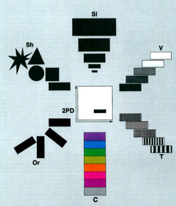

Now in its tenth year, the LibLab Fellows program is an experiment in library-based learning guided by a critical consideration of just what we mean by "the digital." Fellows engage theory and practice of digital scholarship through open lab hours and weekly discussion meetings during the fall semester and spring semester

## Week 1 - September 11: Introductions, Framing & The Infrastructure of the Internet

An introduction to the terrain + the internet and its modalities. This week, we introduce the fellowship and begin by looking at what do we mean when we say *internet*? What makes it different from other forms of information technology and where can we find it? The internet, the idea and its physical infrastructure, permeates every hour of our days. Understanding its history and the metaphors we use to give shape to it, become a daily endevor, so as to continue to have a critical eye towards it.

Reflection: As we move from the physical to the digital. What new information is gained? What is lost? Is this even a helpful dynamic?

Readings:
- [‘As We May Think by Vannevar Bush'](https://www.theatlantic.com/magazine/archive/1945/07/as-we-may-think/303881/)
    - When was this article written? What does the Memex anticipate? What are other concepts still applicable today?
- [Visions for the Future of the Internet](https://findingctrl.nesta.org.uk/)

Optional:
- [The Machine Stops by E.M. Foster](https://www.cs.ucdavis.edu/~koehl/Teaching/ECS188/PDF_files/Machine_stops.pdf)

## Week 2 - September 18: Do Artifacts Have Politics? + Github

What can things *do*? Considering the perspective of Science and Technology Studies. Are the technologies that we will study neutral? In other words, is the saying: “it depends how you use the tool that matters” universally true or is technology inherently biased?

Readings:
- [Winner, Langdon. "Do Artifacts Have Politics?" from *The Whale and the Reactor* (1986).](https://www.cc.gatech.edu/~beki/cs4001/Winner.pdf)
- [Biss, Eula. "Time and Distance Overcome" from *Notes from No Man's Land* (2009).](https://pubs.lib.uiowa.edu/iowareview/article/16487/galley/124886/view/)

- Introduction to Github + its history
- 
## Week 3 - September 25: Github Pages + HTML/CSS/MARKDOWN

This week we dive deeper into Github by utilizing a service that allows us to create static websites. 

## Week 4 - October 2: Metadata / Data

Can data be neutral? What are the ethical considerations of collecting and analyzing data? 

<!-- - [Hui, Yuk. ChatGPT, or the Eschatology of Machines](https://www.e-flux.com/journal/137/544816/chatgpt-or-the-eschatology-of-machines/)
- [Dzieza, Josh. AI Is a Lot of Work: As the technology becomes ubiquitous, a vast tasker underclass is emerging — and not going anywhere.](https://nymag.com/intelligencer/article/ai-artificial-intelligence-humans-technology-business-factory.html)
- [Moderator Mayhem](https://moderatormayhem.engine.is/) -->
  
<!--## Week 5 - October 9: Metadata / Data

Can data be neutral? What are the ethical considerations of collecting and analyzing data? 

<!-- Lisa Gitelman and Virginia Jackson write in the introduction for *"Raw Data" Is an Oxymoron*, 
>"Data need to be imagined as data to exist and function as such, and the imagination of data entails an interpretive base."

What do you think when you hear the term "raw data"? 

- [Gitelman,Lisa & Jackson, Virginia.Raw Data is an Oxymoron: Introduction ](https://doi.org/10.7551/mitpress/9302.001.0001)
- [D'Ignazio,Catherine & Klein, Lauren. Data Feminism: Chapter 1 The Power Chater](https://doi.org/10.7551/mitpress/11805.001.0001)
- [Data Feminism reading group](https://datafeminism.io/blog/book/data-feminism-reading-group/) -->

 - Guest speaker: Emily Higgs Kopin, Head of Digital Collections Strategy)-->

## Week 5 - AI and the Textpocalypse

[Kirschenbaum, Matthew. Prepare for the Textpocalypse](https://www.theatlantic.com/technology/archive/2023/03/ai-chatgpt-writing-language-models/673318/)

## Special lecture 
"10 Things I’m Not Going to Talk about in this Talk about Artificial Intelligence"

by
*Matthew Kirschenbaum, Distinguished University Professor, University of Maryland*

**When**: 4:15 pm, October 9

**Where** : Cunniff Lecture Hall, Science Center 199

## Week 6 - October 23: Accessibility
Can we democratize knowledge? How can we make information more accessible for everyone?

<!--- [Clark, Jasmine. A coordinated effort: Cultural and policy requirements for digital accessibility](https://www.tandfonline.com/doi/full/10.1080/10691316.2021.1932659)

- [Imersive Reader. Video. Watch first 10 minutes](https://learn.microsoft.com/en-us/training/educator-center/product-guides/immersive-reader/)

- HTML/CSS demo. Static vs Dynaic website

- Guest speakers: Jessica Brangiel, Electronic Resources Librarian & Jenn Moore, Course Content Accessibility Manager -->

## Week 7 - October 30: Language of Visualization + Open refine

Can we move beyond pleasing images representing data to and understand that visualizations are a language in themselves? In other words, rather than just understanding visualizations as representations of data can we understand them as data?

In this process, what do we gain access to and, oppositely, what is effaced or made invisible?

<!-- - [Drucker, Johanna. “Graphical Approaches to the Digital Humanities.” *A New Companion to Digital Humanities*, edited by Susan Schreibman et al. (2016): 290–302.](https://ebookcentral.proquest.com/lib/swarthmore/reader.action?docID=4093339&ppg=290) 
- [1969 "Mother of All Demos"](https://youtu.be/B6rKUf9DWRI)
- [Yau, Nathan. Visualizing the Unertainty in Data](https://flowingdata.com/2018/01/08/visualizing-the-uncertainty-in-data/)
- *optional in class reading*[Osman, Jenna. from *Motion Studies*. PEN Poetry Series. November 25, 2015.](https://pen.org/from-motion-studies/)-->

- Guest speaker: James Truitt, Digital Archivist

## Week 8 - November 6: Maps
What are the politics of maps? How does the platform used to create and provide access to geographic information shape our understanding of space? 

<!-- - [How to Lie with Maps](https://tripod.swarthmore.edu/permalink/01TRI_INST/1e1odpu/alma991013533059704921) 
- [How to Map Nothing](https://placesjournal.org/article/how-to-map-nothing/)-->

## Week 9 - November 13: Letterpress

## Week 10 - November 20: Immersive Technologies
What role do emerging technologies play in higher education?

<!-- - [Nakamura, Lisa. Virtous Virtual Realities](https://journals.sagepub.com/doi/full/10.1177/1470412920906259)
- [DLFteach Toolkit Volume 2: Lesson Plans on Immersive Pedagogy](https://dlfteach.pubpub.org/dlfteach-toolkit-2)
- [Make your own avatar](https://readyplayer.me/avatar )-->

## Week 11 - December 4: Surveillance and embodiment
Do we live in a survaillance culture? What are the privacy tradeoffs you make to use the tools you like? More importantly, do you know the liniage of survilance?

<!--  [Browne, Simone. Dark Matters: On the Surveillance of Blackness. Introduction and Ch. 1](https://tripod.swarthmore.edu/permalink/01TRI_INST/ba5lsr/alma991018837042204921)
-  [Brunton, Finn  & Nissenbaum, Helen. Obfuscation: A User's Guide for Privacy and Protest. Chapter 3: Why Obfuscation is Necessary](https://tripod.swarthmore.edu/permalink/01TRI_INST/ba5lsr/alma991018845263404921)-->

## Week 12 - December 11: Celebration + pitches
